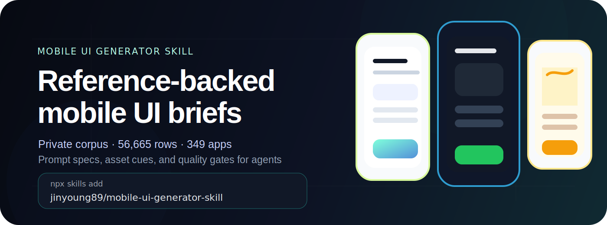

<p align="center">
  
</p>

# Mobile UI Generator Skill

<p align="center">
  <em>Reference-backed mobile UI briefs from a private, authorized mobile UI corpus.</em>
</p>

<p align="center">
  <a href="https://jinyoung89.github.io/mobile-ui-generator-skill/">Website</a>
  · <a href="skills/mobile-ui-reference-generator/SKILL.md">Skill</a>
  · <a href="examples/briefs/fintech-signup.md">Example brief</a>
</p>

---

## What it is

**Mobile UI Generator Skill** helps agents turn a local reference corpus into structured mobile UI briefs and JSON specs.

Instead of asking an agent to invent a generic signup, checkout, onboarding, or booking screen from memory, the skill uses already-prepared local metadata to:

1. retrieve relevant mobile UI references;
2. infer screen types and product domains;
3. select matching asset cues;
4. compile Markdown + JSON briefs;
5. run quality gates for coverage, relevance, prompt completeness, and asset fit.

No unsolicited image generation is part of this workflow. The output is **structured evidence** for design/code/Figma agents.


## 한국어 요약

이 레포는 한국 모바일 UI를 더 쉽게 설명하고 생성하기 위한 **에이전트 스킬 패키지**입니다. 기본 문서는 영어로 유지하지만, 한국 사용자가 바로 이해할 수 있도록 핵심 설명을 함께 제공합니다.

- **무엇을 하나요?** 회원가입, 본인인증, 결제, 상품상세, 지도 예약, 피드 같은 모바일 화면을 만들기 위한 Markdown 브리프와 JSON 스펙을 정리합니다.
- **무엇을 공개하나요?** 공개 레포에는 스킬 설명, 샘플 브리프, HTML/CSS 데모 화면만 포함합니다.
- **무엇을 공개하지 않나요?** 원본 모바일 이미지, private 데이터셋, private 커넥터, API 엔드포인트, 인증 정보는 포함하지 않습니다.
- **웹사이트 예시는 무엇인가요?** 실제 앱 캡처를 올린 것이 아니라, 화면 패턴을 설명하기 위해 직접 만든 HTML/CSS 목업입니다. 모바일에서는 카드뷰를 좌우로 스와이프해서 볼 수 있습니다.

## Privacy boundary

This public repository intentionally does **not** include:

- raw mobile screenshots or downloaded media;
- private connector details, API endpoints, or credentials;
- private crawler/connector code;
- generated local datasets under `data/` or `output/`.

Those pieces stay local/private. The public repo is the skill packaging, showcase page, and sanitized examples.

## Current private corpus summary

The local corpus used to validate the skill currently reports:

| Metric | Value |
|---|---:|
| Indexed UI/media rows | **56,665** |
| Apps/services | **349** |
| Pattern groups | **62** |
| Normalized screen types | **45+** |
| Media handled | PNG, JPG, WebP, MP4, SVG, JSON/Lottie-style metadata |

## Install the agent skill

If your agent supports `SKILL.md` installs:

```bash
npx skills add https://github.com/jinyoung89/mobile-ui-generator-skill \
  --skill mobile-ui-reference-generator
```

Or copy this file directly into your agent skills folder:

```text
skills/mobile-ui-reference-generator/SKILL.md
```

## What the skill produces

| Output | Purpose |
|---|---|
| `reference-manifest.jsonl` | local rows with app/category/screen-type/reference metadata |
| `asset-manifest.jsonl` | icons, splash assets, crops, media metadata, color cues |
| `pattern-book.md` | screen-type pattern summary |
| `mobile-ui-brief.md` | reference-backed prompt + code/Figma brief |
| `mobile-ui-brief.json` | machine-readable UI spec |
| `quality-report.md` | integrity, coverage, prompt, and asset relevance scores |

## Screen taxonomy

The taxonomy is grown from observed mobile UI patterns, then normalized into agent-friendly screen types:

| Flow | Screen types |
|---|---|
| Acquisition | `splash`, `onboarding`, `permission` |
| Auth | `login`, `signup`, `identity_verification`, `terms` |
| Commerce | `product_list`, `product_detail`, `cart`, `payment`, `order_complete`, `order_history` |
| Finance | `finance_account`, `transfer`, `investment_portfolio`, `wallet` |
| Social/content | `feed`, `chat`, `notification`, `profile`, `saved_items`, `review_rating` |
| Mobility | `map_location`, `reservation_booking`, `navigation_route`, `payment` |
| Utility | `settings`, `customer_support`, `announcement`, `empty_state` |


## Font profiles

Typography is part of the generated UI brief. If a service's real brand font is known from public brand guidelines or user-provided design assets, the brief should use that confirmed font. If the exact service font is unknown, the skill uses a **font profile** with a free/public Korean UI font, a CSS/download URL, and a fallback stack.

한국 모바일 UI에서는 폰트, 숫자 가독성, 자간이 결과 품질에 크게 영향을 줍니다. 그래서 브리프에는 가능하면 `font_profile`을 포함합니다.

| Font profile | Good for | Public URL |
|---|---|---|
| Pretendard | neutral Korean app UI, fintech, commerce, productivity | https://github.com/orioncactus/pretendard |
| SUIT | compact modern UI, onboarding, settings, dashboards | https://github.com/sunn-us/SUIT |
| Noto Sans KR | safe Android/Web fallback | https://fonts.google.com/noto/specimen/Noto+Sans+KR |
| IBM Plex Sans KR | tech, AI, analytics, editorial/product screens | https://fonts.google.com/specimen/IBM+Plex+Sans+KR |
| Spoqa Han Sans Neo | friendly consumer services, local commerce, food/lifestyle | https://github.com/spoqa/spoqa-han-sans |
| Wanted Sans | SaaS, recruiting, productivity, professional services | https://github.com/wanteddev/wanted-sans |

Example brief field:

```yaml
font_profile:
  family: Pretendard
  css_url: https://cdn.jsdelivr.net/gh/orioncactus/pretendard/dist/web/static/pretendard.css
  fallback: -apple-system, BlinkMacSystemFont, "Apple SD Gothic Neo", "Noto Sans KR", sans-serif
  confidence: recommended fallback
  reason: Neutral Korean mobile UI with strong numeric readability.
```

Rules:

- Do not invent a service-specific font name.
- Use confirmed brand fonts only when the user provides them or public brand/design docs confirm them.
- Always include a fallback stack for iOS, Android, and Web.
- Check each font license before commercial use.

## Quality gates

Quality is not the number of screenshots. The skill checks whether references actually help generation:

| Gate | Checks |
|---|---|
| Integrity | files exist, images decode, MP4/SVG/JSON metadata is preserved, duplicates controlled |
| Coverage | app, domain, screen-type, and pattern diversity |
| Relevance | multi-step queries retrieve matching target screens first |
| Asset fit | assets are selected from the same target screen/app before generic fallbacks |
| Brief completeness | reference evidence, asset references, native-mobile constraints, Korean copy guidance, valid JSON spec |

## Example mobile views

The website includes eight HTML/CSS mobile views produced from the skill's current brief templates, not from an image generator or uploaded app screenshots. On mobile, the cards can be swiped horizontally.

- fintech signup / phone verification;
- personalized onboarding;
- commerce checkout;
- delivery tracking;
- mobility booking;
- finance transfer;
- healthcare booking;
- social feed.

Open the showcase:

```text
https://jinyoung89.github.io/mobile-ui-generator-skill/
```

## Repository layout

```text
skills/mobile-ui-reference-generator/SKILL.md
examples/briefs/                  # public sample briefs
examples/specs/                   # public sample UI specs
docs/index.html                   # static showcase page
docs/assets/                      # public SVG artwork
```

## License

MIT
